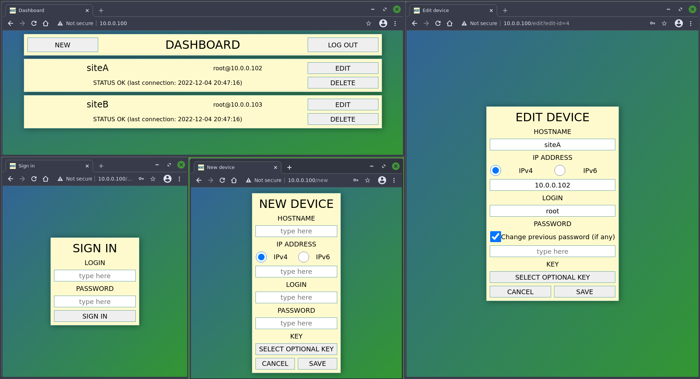
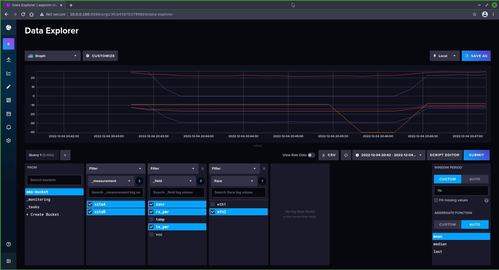
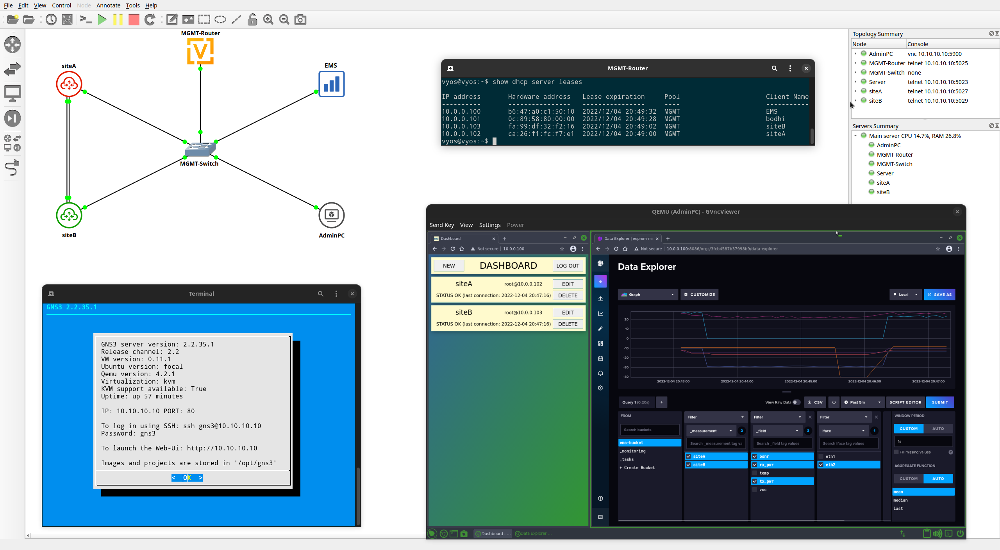

# EEPROM Monitoring Server
The server for extracting EEPROM data from SFP modules such as temperature, voltage, Tx/Rx powers an OSNR. Repository also contains the EEPROM Presenter container which might be used with EMS in GNS3 simulations. To adjust EEPROM values over time use the EEPROM Generator.

## EMS capabilities
### Configuration page
The server provides a web-based graphical interface that allows administrator to declare which network devices should be queried. Configuration consists of providing host-name, IP address, login and password or key as on picture below.



### Prometheus dashboard
The configured Server periodically gain SFPs' EEPROM data from network hosts. It is stored in [Influx database](https://www.influxdata.com/). The feature of the Server is to visualize the collected data, particularly over time and in the past.



## Project structure
* `.github/` - GNS3 appliances and resources for README 
* `backend/` – main alghoritm for extracting EEPROM from network hosts and inserting to InfluxDB
* `frontend/` – devices' configuration site
* `generator/` - EEPROM Generator (described later)
* `presenter/` - EEPROM Presenter (described later)
* `testdata/` - databasedump, EMS and EG config files
* `utils/` – common packet for reading config and database interactions 

## Building from source
### Preconditions
To successfully build all steps it is required to have installed:
* make
* Go v1.21 or later
* Docker
* wget and tar

### Configuration file
Sample config file is provided in `testdata/ems.yaml`. It contains server's startup configuration like users, MySQL and InfluxDB databases, and time delays. Adjust `ems-build` step in `Makefile` to build with file from different location.

### Building
To build EMS and EG run:
```
make
```

To build generic EP (with scenario from `testdata/generator.yaml` file) run:
```
make sample-eeprom-presenter
```

## EEPROM Monitoring Server
### Pulling from Docker Hub
The container is already compiled and available on [DockerHub](https://hub.docker.com/r/piotrjwegrzyn/eeprom-monitoring-server). To pull type in terminal:
```
docker pull piotrjwegrzyn/eeprom-monitoring-server:latest
```

### Usage
When the Docker container is ready you can start it typing:
```
docker run [-ti/d] [--rm] -p 80:<CONFIG_PORT> -p 8086:8086 piotrjwegrzyn/eeprom-monitoring-server:latest
```

Flags `-ti` or `-d` will determine if container will be started in "Terminal Interaction" mode or "Detached".

By default, CONFIG_PORT is 80 and there is `frontend` page available. Prometheus dashboard is on port 8086.

## EEPROM Presenter
Simple container with commands to list optical interfaces and show EEPROM data on them.

### Preconditions
EEPROM files are needed to build EP. You can generate them using EEPROM Generator (the section below EP). Having EEPROM files put the correct path for them as build argument `EEPROM_SRC` in `Makefile` (`presenter` step). You can adjust `SLEEP_TIME` to change the default (1s).

**Note**: Folders' names in `EEPROM_SRC` directory should reflect network interfaces' names. The designed hierarchy should be:
```
EEPROM_SRC/
- eth0/
  - eth0-000000000
  - eth0-000000001
  - ...
- eth1/
  - eth1-000000000
  - eth1-000000001
  - ...
```
**Note**: Pass the `EEPROM_ITER` build argument with value set to number of items from the most numerous folder in `EEPROM_SRC`.

### Build and run
To build EP type in terminal:
```
make presenter
```
The output container will be named as `pi-wegrzyn/ep:<VERSION>`.

To manually run EP container:
```
docker run -ti pi-wegrzyn/ep:latest
```

### Usage
```
# Show all optical ports:
show-fiber-interfaces

# Show EEPROM on a specific interface:
show-eeprom <IFACE>
```

## EEPROM Generator
Simple tool for generating some EEPROM pages of optical modules based on scenario predefined. Compatible with CMIS 5. Pages that are (partially) supported:
* Lower page
* Page 00h
* Page 01h
* Page 02h
* Page 04h
* Page 11h
* Page 12h
* Page 25h (OSNR only)

### Build
To build EG type in terminal:
```
make generator
```
The output file will be located in `bin/eeprom-generator`.

### Usage
Type in terminal:
```
./eeprom-generator -c <CONFIG_FILE.yaml> -o <OUTPUT_PATH>
```

### Config file
Sample config file is provided in `testdata/generator.yaml`. 
In configuration file there is a scenario's duration defined in seconds and modules list. The `Modules` list contains an interface name, CMIS content data and a `Scenario` with a bunch of fiber-working parameters as below:

```
  Scenario:
    Temperature:
      - endval: 33.0
        duration: 120
      - endval: 32.0
        duration: 180
```

For the first 120 seconds the value of `Temperature` will be interpreted as `33.0` like a linear function with start and end points (X, Y) set as (1, 33.0) and (33.0, 120). Then from the 121st second till the end (120+180) the `Temperature` will slowly decrease like a linear function with starting point (X, Y) as (121, 33.0) and ending point as (300, 32.0).

If there is a need of preparing an instant change we are able to change that defining a one-second-event as the middle step below:
```
  Scenario:
    Temperature:
      - endval: 33.0
        duration: 120
      - endval: 10.0
        duration: 1
      - endval: 10.0
        duration: 179
```

**Note**: the very first step will always be a flat function with defined `endval`. If you want to start linear change from the beginning you should create one-second-event step.

## How to run in GNS3's project
### EEPROM Monitoring Server
Preconfigured EMS might be imported directly to GNS using [DockerHub image](https://hub.docker.com/r/piotrjwegrzyn/eeprom-monitoring-server). Download [template file](.github/ems-dockerhub.gns3a) and import to GNS3.



### EEPROM Monitoring Server - adjusted
If you need adjusted config file etc. you can prepare container manually. Open shell on your GNS3 server, clone repository, make changes and build as described in previous sections. Then follow [that guide](https://docs.gns3.com/docs/emulators/docker-support-in-gns3).

### EEPROM Presenter
Preconfigured EP's with sample EEPROM data might be imported directly to GNS using [DockerHub images](https://hub.docker.com/r/piotrjwegrzyn/eeprom-presenter). Download and import [EP-siteA](.github/ep-site-a-dockerhub.gns3a) and [EP-siteB](.github/ep-site-b-dockerhub.gns3a).

**Note**: When running in GNS3 do not type `exit` in container's console because it leads to container shutdown.

### EEPROM Presenter - adjusted
Open shell on your GNS3 server, clone repository, make changes and build as described in EEPROM Presenter section. Then follow [that guide](https://docs.gns3.com/docs/emulators/docker-support-in-gns3).

**Note**: Default GNS3 interfaces are enumerating as eth0, eth1 and so on. Keep in mind that when generating EEPROM files with EG.

## License
All software in this repository (except Influx software) is published under GNU General Public License v3. See [LICENSE file](LICENSE).
