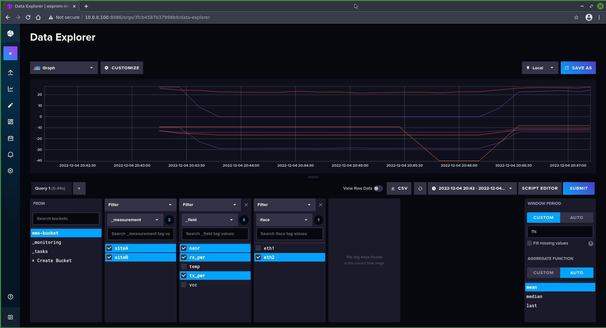
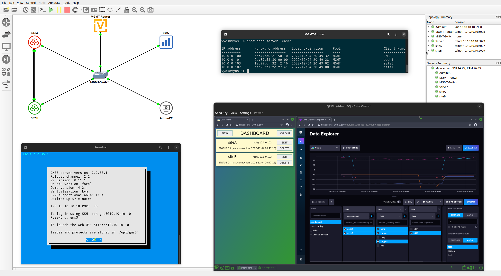

# EMS - EEPROM Monitoring Server
The server for extracting EEPROM data from SFP modules such as temperature, voltage, Tx/Rx powers an OSNR.

## Project structure

* `backend/` – main algorithm
* `common/` – package for config parsing and database interactions 
* `config/` – example configuration file and database dump
* `frontend/` – devices' configuration site
* `static/` – CSS and favicon for devices' configuration site
* `templates/` – html template files for devices' configuration site
* `build_img.sh` – script for building EMS container from scratch
* `Dockerfile` – recipe for EMS container

## Capabilities

### Configuration page

The server provides a web-based graphical interface that allows administrator to declare which network devices should be queried. Configuration consists of providing host-name, IP address, login and password or key as on picture below.


### Prometheus dashboard

The configured Server periodically gain SFPs' EEPROM data from network hosts. It is stored in [Influx database](https://www.influxdata.com/). The feature of the Server is to visualize the collected data, particularly over time and in the past.



## Pulling from Docker Hub
The container is already compiled and available on [Docker Hub](https://hub.docker.com/r/piotrjwegrzyn/eeprom-monitoring-server). To pull type in terminal:
```
docker pull piotrjwegrzyn/eeprom-monitoring-server:latest
```

## Building from source – `build_img.sh`
Adjust configuration file for your purposes and place it in `config/` folder with name `config.yaml`.
Then open folder in Terminal and type:
```
./build_img.sh
```

The `build_img.sh` script downloads Go compiler (if not available), compiles `backend` and `frontend` modules and parses Dockerfile with configuration provided via `config.yaml`.
Also InfluxDB is downloaded.

NOTE: Modules should be compiled with Go 1.19 or later.

## Usage
Then, the Docker container is ready and you can start it typing:
```
docker run [-ti/d] [--rm] -p 80:<CONFIG_PORT> -p 8086:8086 piotrjwegrzyn/eeprom-monitoring-server:latest
```

Flags `-ti` or `-d` will determine if container will be started in "Terminal Interaction" mode or "Detached".

By default, CONFIG_PORT is 80 and there is configuration page available. Prometheus dashboard is on port 8086.

## Usage in GNS3

This container can be used in GNS3 simulation. To import it download [template file](gitresources/ems-template.gns3a) and import to GNS3.




## Config file
Sample config file is provided in main `config/` directory. It contains server's startup configuration like users, MySQL and InfluxDB databases, and time steps.

Config path might be provided explicitly.

## License
[GNU GENERAL PUBLIC LICENSE](https://github.com/piotrjwegrzyn/eeprom-monitoring-server/blob/master/LICENSE)

